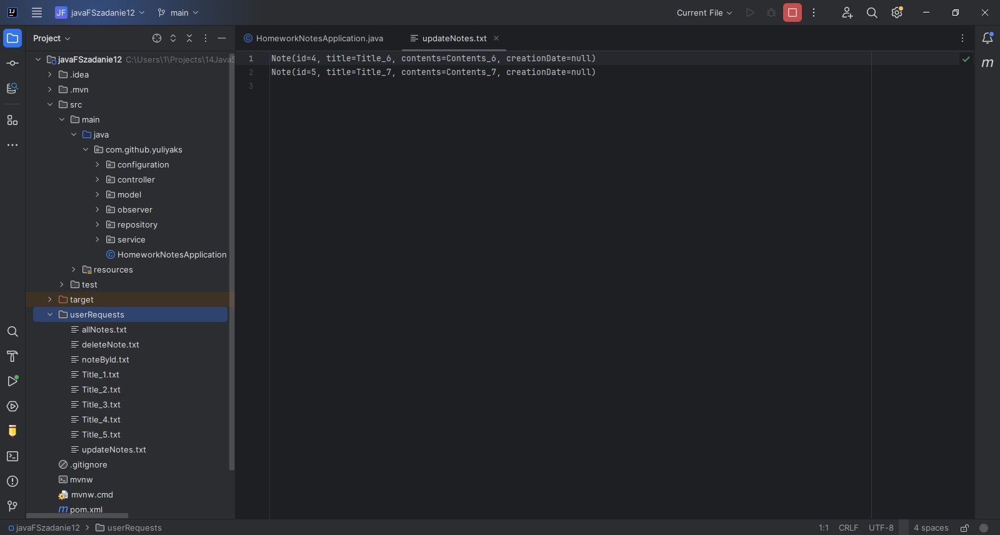
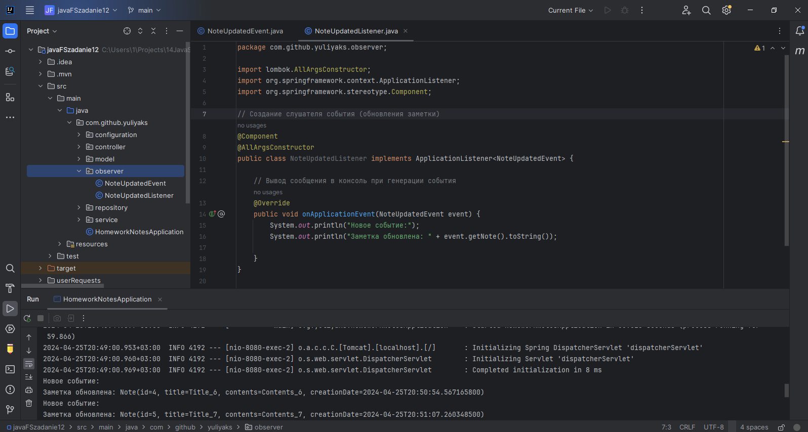

# Фреймворк Spring

## Урок 12. Паттерны проектирония и GoF паттерны в Spring приложении

### Задание:

1) На базе первого примера разобранного на семинаре, добавить в один из проектов разработанных ранее spring Integration. Сохранять запросы от пользователя в файл.
2) Добавить в проект один из паттернов разобранных на лекции.

 

### Решение:
 

Все запросы от пользователя сохранены в папку ./userRequests

 

В проект добавлен паттерн Observer

